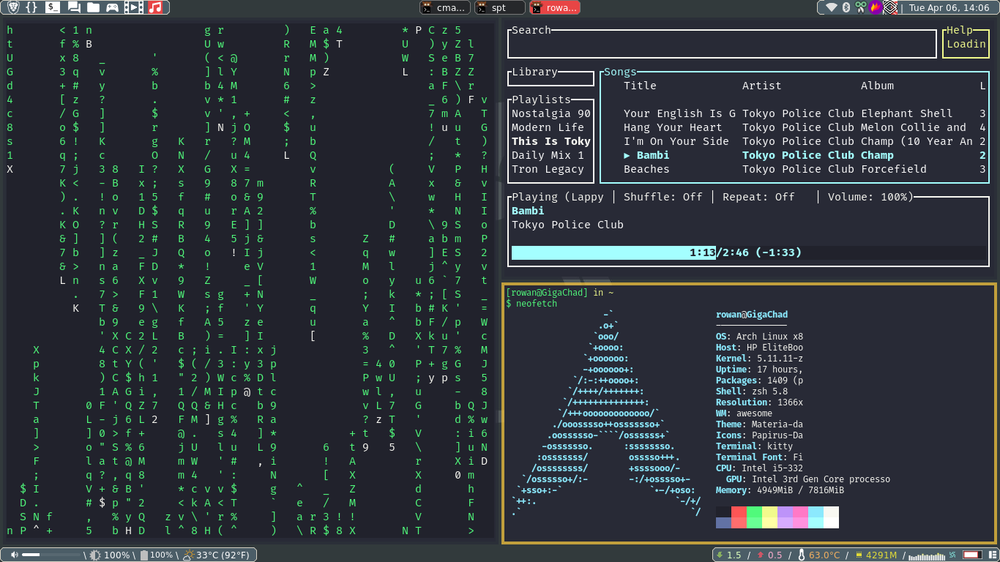

My awesome config
=======
Originally ripped from awesomecopycats, dt, and CTT, I have made a bastardized version of my own rice.
I keep multiple rices which can be found in themes/.

Todo
=======
- [ ] Refactor rc.lua
- [ ] Refactor custom/theme.lua
- [ ] Move keybind config to a different file.
- [ ] Implement bling window swallowing
- [ ] Create music widget for the bottom bar

